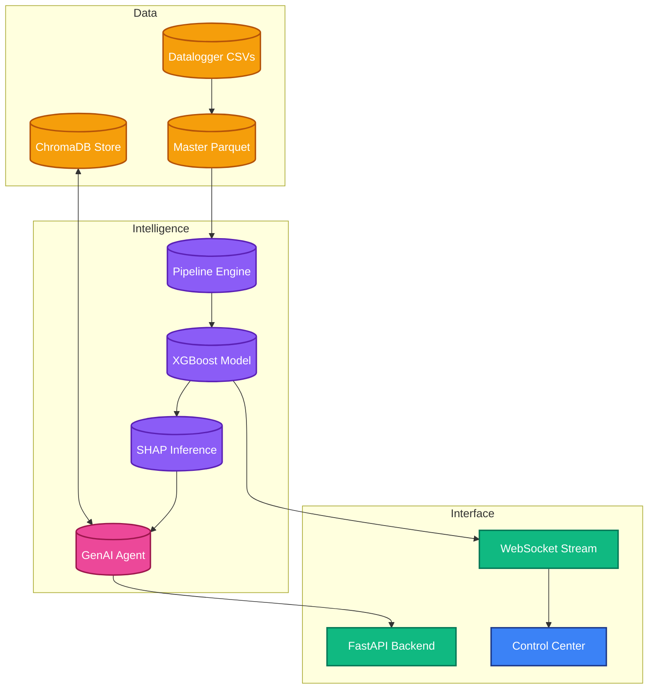

# ☀️ SolarMind: Industrial AI for Solar Excellence

**SolarMind** is a production-ready, industrial AI platform designed for predictive maintenance, fault isolation, and operational intelligence in utility-scale solar PV plants. 

By unpivoting complex, multi-dimensional datalogger telemetry and applying localized XGBoost modeling, SolarMind identifies equipment degradation signatures *days* before they manifest as critical failures.

---

## 💎 Core Capabilities

### 1. Predictive Maintenance Engine (Layer 3)
- **XGBoost Classifier**: A calibrated binary classifier trained to detect failure events within a 7–10 day forward window.
- **Explainable AI (XAI)**: Native integration of **SHAP (SHapley Additive exPlanations)** to extract granular feature contributions.
- **Delta-SHAP Inference**: A temporal contrast mechanism that compares current importance vectors against T-24h baselines to detect rapid drifts in thermal or electrical state.

### 2. Feature Engineering Pipeline (Layer 2)
- **Physics-Derived Features**: Real-time compute of **Conversion Efficiency** and **Thermal Gradients** clip-detected for nighttime thresholds.
- **Plant-Context Benchmarking**: Dynamic ranking of inverters (power, temperature, efficiency) against the real-time average of their respective plants to isolate local faults from global environmental variants (e.g., cloud cover).
- **Cyclical Encoding**: Fourier transforms applied to temporal variables (`hour`, `month`, `day_of_year`) to capture solar irradiance cycles.

### 3. Generative AI & RAG (Layers 4 & 5)
- **Grounded Narrative Generation**: LLM-based diagnostics grounded in a strict **Fault Isolation Logic** matrix (e.g., MPPT Imbalance vs. Thermal Disconnect).
- **ChromaDB Vector Store**: A 90-day rolling window of maintenance logs and prediction reports, enabling natural-language querying of plant history.
- **Pydantic Guardrails**: Ensuring all GenAI outputs follow strictly typed industrial reporting schemas.

---

## 🏗️ System Architecture

SolarMind is built using a strict 10-layer decoupled architecture:



---

## 🔌 API Reference

The backend exposes a comprehensive FastAPI suite with Bearer JWT authentication:

| Endpoint | Method | Description |
| :--- | :--- | :--- |
| `/auth/token` | `POST` | OAuth2 authentication (admin access). |
| `/predict` | `POST` | High-fidelity inference with narrative generation. |
| `/query` | `POST` | RAG-powered natural language plant search. |
| `/inverters` | `GET` | List all inverters with cached latest-state KPI. |
| `/inverters/{id}/trends` | `GET` | 48-hour trend data for dashboard charts. |
| `/inverters/{id}/shap` | `GET` | Real-time feature importance (SHAP). |
| `/ws/stream/{plant_id}` | `WS` | Continuous 60s/2s telemetry replay stream. |
| `/metrics` | `GET` | Prometheus instrumentation (latencies, counts). |

---

## 🛠️ Installation & Setup

### 1. Environment Configuration
Clone the repository and create a `.env` file based on `.env.example`:
```bash
git clone https://github.com/gopu07/SolarMind.git
cd SolarMind
# Add OPENAI_API_KEY to .env
```

### 2. The Data Pipeline (Layer 1-3)
SolarMind requires an 18-month training / 6-month simulation split.
```bash
# Ingest and standardise raw telemetry
python scripts/ingest_raw.py

# Compute feature vectors and train XGBoost
python features/pipeline.py
python models/train.py

# Generate precomputed replay predictions for UI performance
python scripts/generate_replay_predictions.py
```

### 3. Service Deployment
```bash
# Start Backend (Port 8000)
uvicorn api.main:app --reload

# Start Frontend (Port 5173 - Vite)
cd dashboard && npm install && npm run dev
```

---

## 📂 Repository Structure

```text
├── agent/             # Agentic workflows (LangGraph)
├── api/               # FastAPI layer (Routers, Schemas, Auth)
├── dashboard/         # React/Tailwind frontend command center
├── data/              # Raw data in-buffer & Processed Parquet
├── features/          # Feature engineering (Physics & Benchmarking)
├── genai/             # LLM Prompts & Pydantic Guardrails
├── models/            # ML Training & Prediction Logic
├── rag/               # Vector ingestion & retrieval logic
├── scripts/           # Ingestion and ingestion-automation scripts
└── tests/             # Layer-specific Pytest suite (95% coverage goal)
```

---

## 📄 License
Licensed under the [MIT License](LICENSE). 
Designed with ☀️ for the renewable energy future.
