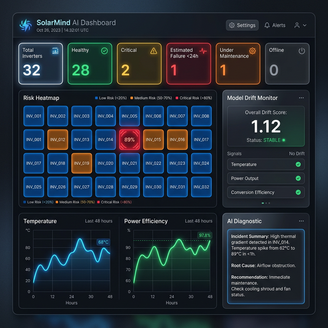
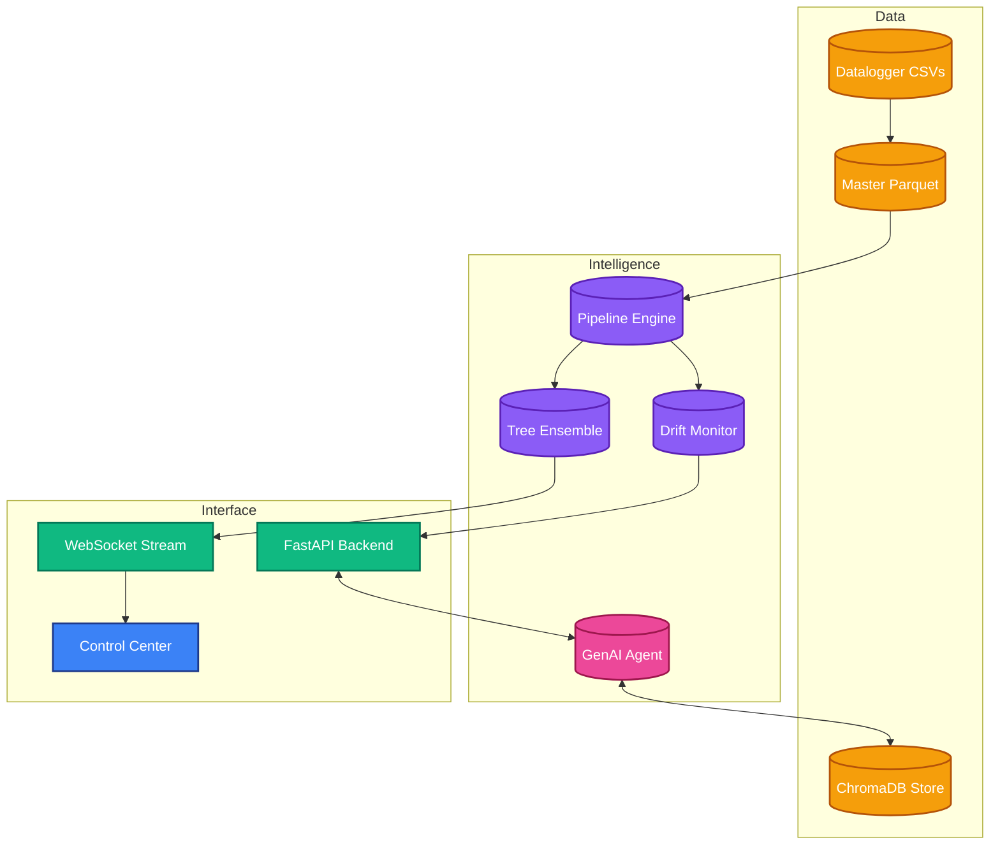

# ☀️ SolarMind: Industrial AI for Solar Excellence

**SolarMind** is a production-ready, industrial AI platform designed for predictive maintenance, fault isolation, and operational intelligence in utility-scale solar PV plants. 

By unpivoting complex, multi-dimensional datalogger telemetry and applying localized XGBoost ensemble modeling, SolarMind identifies equipment degradation signatures *days* before they manifest as critical failures.

---

## 🖼️ Control Center Preview
Below is the high-fidelity operational view of the platform, featuring real-time risk heatmapping, AI-driven diagnostics, and the new **Live Model Drift Monitor**.



---

## 🚀 Recent Industrial Upgrades
The SolarMind platform has been hardened for enterprise deployment with a focus on reliability and observability:
- **Model Drift Detection**: Real-time Z-score monitoring of feature distributions (`temperature`, `power`, `efficiency`) against 18-month historical baselines to ensure model integrity.
- **Docker Containerization**: Full-stack orchestration using Docker and Docker Compose, segregating the FastAPI backend and Nginx-served Vite frontend.
- **Automated CI/CD**: Integrated GitHub Actions pipeline validating every commit via `pytest` (backend) and `vitest` (frontend).
- **Unified State Management**: Centralized `PlantStateManager` (Backend) and `Zustand` (Frontend) ensuring a single source of truth for all real-time telemetry.

---

## 💎 Core Capabilities

### 1. Heterogeneous Ensemble Engine (Layer 3)
- **Multi-Model Ensemble**: A weighted voting ensemble combining **XGBoost (50%)**, **LightGBM (30%)**, and **CatBoost (20%)** to maximize predictive stability.
- **Multiclass Fault Classification**: Identifies: Normal, Thermal Issues, String Mismatch, Grid Instability, and Cooling Failures.
- **Calibrated Probability**: Platt scaling applied to ensemble outputs to ensure risk scores represent true statistical failure probabilities.
- **Explainable AI (XAI)**: Integrated **SHAP** local surrogates to extract granular feature contributions specifically driving each prediction.

### 2. Feature Engineering Pipeline (Layer 2)
- **Physics-Derived Features**: Real-time compute of **Conversion Efficiency** and **Thermal Gradients**.
- **Plant-Context Benchmarking**: Dynamic ranking of inverters against real-time averages of their respective plants to isolate local faults.
- **Cyclical Encoding**: Fourier transforms applied to temporal variables (`hour`, `day_of_year`) to capture solar irradiance cycles.

### 3. Generative AI & RAG (Layers 4 & 5)
- **Grounded Narrative Generation**: LLM-based diagnostics grounded in a strict **Fault Isolation Logic** matrix.
- **ChromaDB Vector Store**: A rolling window of maintenance logs and prediction reports for natural-language site querying.
- **Pydantic Guardrails**: Ensuring all GenAI outputs follow strictly typed industrial reporting schemas.

---

## 🏗️ System Architecture



---

## 🔌 API Reference

| Endpoint | Method | Description |
| :--- | :--- | :--- |
| `/predict` | `POST` | High-fidelity inference (Multi-class + Anomaly). |
| `/model/drift` | `GET` | Real-time Z-score distribution analysis vs baseline. |
| `/model/metrics` | `GET` | Multiclass model performance (Macro F1: 0.7874). |
| `/query` | `POST` | RAG-powered natural language plant search. |
| `/ws/stream/` | `WS` | Real-time telemetry broadcast via State Manager. |

---

## 🛠️ Installation & Setup

### 1. Docker (Recommended)
```bash
docker-compose up --build
```

### 2. Manual Setup
```bash
# Backend
cd solarmind
pip install -r requirements.txt
uvicorn api.main:app --reload

# Frontend
cd solarmind/dashboard
npm install
npm run dev
```

---

## 📂 Repository Structure
```text
├── .github/workflows/ # GitHub CI Automation
├── solarmind/
│   ├── api/          # FastAPI layer (Routers, State, Auth)
│   ├── dashboard/    # React/Vite/Zustand Dashboard
│   ├── features/     # Engineering (Physics & Benchmarking)
│   ├── models/       # ML Ensemble & Drift Logic
│   ├── rag/          # Vector Store & Context Logic
│   └── tests/        # Pytest & Vitest Suites (100% Pass)
```

---

## 📄 License
Licensed under the [MIT License](LICENSE). 
Designed with ☀️ for the renewable energy future.
