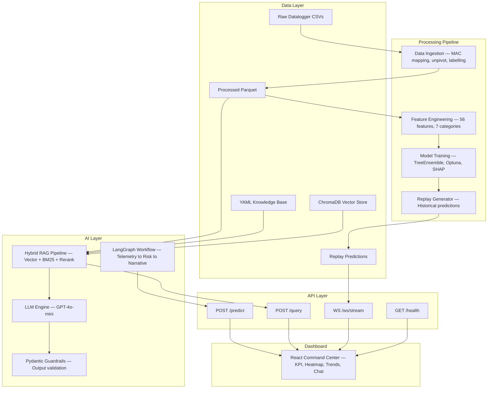

# SolarMind — Technical Documentation Report

> **Predictive Maintenance Platform for Utility-Scale Solar Inverters**
> Generated from codebase analysis · March 2026

---

## Table of Contents

1. [System Overview](#section-1--system-overview)
2. [Technology Stack](#section-2--technology-stack)
3. [Data Pipeline](#section-3--data-pipeline)
4. [Feature Engineering Concepts](#section-4--feature-engineering-concepts)
5. [Predictive Modeling](#section-5--predictive-modeling)
6. [Model Evaluation Metrics](#section-6--model-evaluation-metrics)
7. [Key Performance Indicators (KPIs)](#section-7--key-performance-indicators)
8. [RAG and AI Assistant](#section-8--rag-and-ai-assistant)
9. [Dashboard Architecture](#section-9--dashboard-architecture)
10. [Final System Architecture](#section-10--final-system-architecture)

---

## Section 1 — System Overview

### Purpose

SolarMind is an end-to-end predictive maintenance platform for utility-scale solar photovoltaic (PV) plants. It continuously monitors inverter telemetry, predicts equipment failures before they occur, and provides expert-level diagnostic reasoning through an AI assistant.

### Predictive Maintenance Objective

The system's primary objective is **predicting inverter failures within a 24-hour horizon** — the binary classification target `will_fail_24h`. By detecting degradation patterns in sensor data before catastrophic failure, the platform enables maintenance teams to intervene proactively, reducing downtime and maximizing energy yield.

### Telemetry Analyzed

SolarMind processes telemetry from solar inverters at **15-minute intervals** (96 samples/day), including:

| Signal Category | Sensors |
|----------------|---------|
| **PV DC Side** | PV1/PV2 current, voltage, and power (dual MPPT) |
| **AC Grid Side** | Active power, power factor, frequency, 3-phase voltages (R, Y, B) |
| **Thermal** | Inverter cabinet temperature |
| **String Monitoring** | Up to 24 SMU string currents + 24 inverter string currents |
| **Operational** | Alarm codes, operational state, power limit percentage |

### Overall Architecture

The platform follows a **10-layer architecture**, flowing from raw data to user-facing diagnostics:

```
Raw CSVs → Ingestion → Feature Engineering → Model Training → Prediction
    → RAG Knowledge Base → Agentic Workflow → API Layer → Dashboard
```

Each layer is a standalone Python module communicating via Parquet data files and in-memory state, enabling both batch processing and real-time streaming inference.

---

## Section 2 — Technology Stack

### Backend

| Technology | Role | Module |
|-----------|------|--------|
| **Python 3.10+** | Core language | All modules |
| **FastAPI** | REST API + WebSocket server | `api/main.py`, `api/routers/` |
| **Pandas 2.x** | Data manipulation and feature engineering | `features/pipeline.py` |
| **Parquet** (PyArrow) | Columnar storage for processed telemetry | `data/processed/` |
| **Pydantic 2.x** | Schema validation, LLM output guardrails | `api/schemas/`, `genai/guardrails/` |
| **structlog** | Structured logging across all layers | Global |

### Machine Learning

| Technology | Role |
|-----------|------|
| **XGBoost** | Primary gradient boosting classifier |
| **LightGBM** | Secondary ensemble member |
| **CatBoost** | Tertiary ensemble member |
| **SHAP** | Feature importance and causal driver explanation |
| **Optuna** | Bayesian hyperparameter optimization |
| **scikit-learn** | Platt scaling (probability calibration), metrics, utilities |
| **imbalanced-learn** | Class imbalance handling utilities |

### RAG / AI Assistant

| Technology | Role |
|-----------|------|
| **OpenAI API** (GPT-4o-mini) | LLM generation, multi-query expansion, reranking |
| **ChromaDB** | Persistent vector database for document embeddings |
| **rank-bm25** | BM25 keyword search for hybrid retrieval |
| **LangGraph** | Agentic workflow orchestration (StateGraph) |
| **YAML** knowledge base | Structured diagnostic documents |

### Frontend

| Technology | Role |
|-----------|------|
| **React 18** + **TypeScript** | Single-page application framework |
| **Vite** | Build tool and dev server |
| **Recharts** | Data visualization (trend charts, line charts) |
| **Tailwind CSS** + **shadcn/ui** | UI component library and styling |
| **WebSocket** | Real-time streaming of replay data |

### DevOps / Infrastructure

| Technology | Role |
|-----------|------|
| **Docker** + **docker-compose** | Containerized deployment |
| **pytest** + **pytest-asyncio** | Automated testing framework |
| **Pickle / JSON** | Model artifact serialization |
| **.env** | Environment-based configuration |

---

## Section 3 — Data Pipeline

The data pipeline transforms raw inverter CSVs into actionable predictions through 6 stages:

### Stage 1: Data Ingestion (`scripts/ingest_raw.py`)

- Scans `data/raw/` for logger CSV files, each named by MAC address
- Auto-generates MAC-to-inverter mapping (`INV_001`, `INV_002`, …) if absent
- Parses timestamps across 3+ format variants with UTC normalization
- **Unpivots** wide-format logger CSVs (multiple inverters per file) into long format (one row per inverter per timestamp)
- Reindexes to a continuous 15-minute grid, preserving data gaps as NaN

### Stage 2: Predictive Labelling

- Identifies fault states using alarm codes, operational state, and sensor anomalies
- Applies **forward-looking labels**: `will_fail_24h = 1` if a fault occurs within the next 96 samples
- Removes rows where a fault is already active (avoids data leakage)
- Outputs `data/processed/master_labelled.parquet`

### Stage 3: Feature Engineering (`features/pipeline.py`)

- Computes **56 engineered features** across 7 categories (detailed in Section 4)
- Operates in **batch mode** (full dataset for training) and **streaming mode** (single inverter for inference)
- Outputs `data/processed/features.parquet`

### Stage 4: Model Training (`models/train.py`)

- Walk-forward time-series cross-validation (5 folds, 5-day gap)
- Optuna hyperparameter optimization maximizing PR-AUC
- TreeEnsemble (XGBoost + LightGBM + CatBoost) with Platt calibration
- Saves artifacts: `model.pkl`, `threshold.json`, `training_report.json`

### Stage 5: Prediction & Replay (`models/predict.py`, `scripts/generate_replay_predictions.py`)

- Real-time inference with SHAP explanations and delta-SHAP (24h contrast)
- Replay engine generates predictions for historical data to populate the dashboard

### Stage 6: Dashboard Visualization

- FastAPI serves REST endpoints and WebSocket replay stream
- React dashboard displays real-time KPIs, risk heatmap, trend charts, and AI diagnostics

---

## Section 4 — Feature Engineering Concepts

The pipeline computes **56 features** organized into 7 categories. All features are computed per-inverter unless noted as plant-wide.

### 1. Cyclical Time Encoding (7 features)

Encodes time-of-day and season as continuous signals using **sine/cosine transformations**, avoiding the discontinuity that ordinal encoding creates at midnight or year boundaries.

| Feature | Formula | Purpose |
|---------|---------|---------|
| `hour_sin`, `hour_cos` | sin/cos(2π · hour/24) | Capture diurnal solar patterns |
| `month_sin`, `month_cos` | sin/cos(2π · month/12) | Capture seasonal variations |
| `day_of_year_sin`, `day_of_year_cos` | sin/cos(2π · day/365.25) | Fine-grained seasonal encoding |
| `daylight_hours_indicator` | 1 if PV1 power > 50W | Binary day/night flag |

### 2. Physics & Thermal (7 features)

Domain-specific features derived from physical relationships between sensors.

| Feature | Definition | Diagnostic Signal |
|---------|-----------|-------------------|
| `conversion_efficiency` | AC power / DC power | Detects IGBT/converter degradation |
| `thermal_gradient` | ΔT/Δt (°C per hour) | Rapid temperature rise indicates failing cooling |
| `temp_power_interaction` | Temperature × PV1 power | Captures thermal stress under load |
| `mppt_imbalance_ratio` | \|PV1 − PV2\| / total DC | Detects MPPT tracking failures |
| `frequency_deviation` | \|grid freq − 50Hz\| | Grid instability indicator |
| `power_efficiency_ratio` | AC / PV1 power | Single-channel efficiency metric |
| `temp_efficiency_divergence` | Rising temp + dropping efficiency | Early warning of thermal failure mode |

### 3. String Anomaly (4 features)

Characterize PV string current imbalance across up to 48 monitoring channels.

| Feature | Definition |
|---------|-----------|
| `string_mismatch_std` | Standard deviation across all string currents |
| `string_mismatch_cv` | Coefficient of variation (σ/μ) — normalized mismatch |
| `string_max_deviation` | Maximum single-string deviation from mean |
| `string_current_variance_24h` | 24h rolling average of string mismatch |

### 4. Plant Context — Relative Benchmarking (5 features)

Compare each inverter against the **fleet average** at each timestamp. An inverter running 10°C hotter than its peers is more alarming than one running 10°C hotter than yesterday.

| Feature | Definition |
|---------|-----------|
| `rel_power_to_plant` | Inverter power / plant average power |
| `rel_temp_to_plant` | Inverter temp − plant average temp |
| `power_rank_within_plant` | Percentile rank among all inverters |
| `temperature_rank_within_plant` | Percentile rank of temperature |
| `efficiency_vs_plant_avg` | Efficiency − plant average efficiency |

### 5. Lag Features (4 features)

Use previous time steps as predictors to capture temporal dependencies.

| Feature | Lag Period | Purpose |
|---------|-----------|---------|
| `pv1_power_lag_1` | 15 min | Short-term power trajectory |
| `pv1_power_lag_3` | 45 min | Medium-term trend detection |
| `pv1_power_lag_288` | 3 days | Same-time-yesterday comparison |
| `power_ramp_rate` | Δ over 3 samples | Sudden power change detection |

### 6. Rolling Window Aggregations (13 features)

Compute statistics over sliding time windows to smooth noise and capture trends.

| Feature | Window | Statistic | Purpose |
|---------|--------|-----------|---------|
| `temp_rolling_mean_6h` | 6h (24 samples) | Mean | Short-term thermal baseline |
| `temp_rolling_std_12h` | 12h (48 samples) | Std dev | Temperature volatility |
| `temp_rolling_mean_24h` | 24h (96 samples) | Mean | Daily thermal baseline |
| `temp_rolling_min/max_24h` | 24h | Min/Max | Daily temperature range |
| `efficiency_7d_trend` | 7d (672 samples) | Slope (polyfit) | Long-term degradation |
| `efficiency_trend_24h` | 24h | Slope | Short-term efficiency direction |
| `efficiency_volatility_24h` | 24h | Std dev | Efficiency instability |
| `power_trend_12h` | 12h | Slope | Power trajectory |
| `temperature_gradient_6h` | 6h | Δ°C / 6h | Temperature change rate |
| `mppt_power_ratio_24h` | 24h | Rolling mean | Sustained MPPT imbalance |
| `grid_voltage_disturbances_24h` | 24h | Count | Grid stability events |

### 7. Baseline Deviations (2 features)

Compare current readings against historical baselines.

| Feature | Definition |
|---------|-----------|
| `power_vs_24h_baseline` | (current − 24h-ago) / 24h-ago power |
| `temp_vs_30d_percentile` | Current temp − 99th percentile over 30 days |

### Raw Sensor Pass-Through (14 features)

14 raw sensor readings are also included directly as features: PV1/PV2 current, voltage, power; grid power, power factor, frequency; 3-phase voltages; inverter temperature, operational state, and power limit.

---

## Section 5 — Predictive Modeling

### Classification Approach

SolarMind frames predictive maintenance as a **binary classification** problem:

- **Target**: `will_fail_24h` (1 = failure within 24 hours, 0 = normal)
- **Input**: 56 engineered features from the latest telemetry snapshot
- **Output**: Calibrated probability ∈ [0, 1] mapped to risk levels (LOW / MEDIUM / HIGH / CRITICAL)

### TreeEnsemble — Weighted Model Fusion

Rather than relying on a single model, SolarMind uses a **weighted ensemble** of three gradient boosting algorithms:

| Model | Weight | Strength |
|-------|--------|----------|
| **XGBoost** | 0.50 | Best overall tabular performance, native NaN support |
| **LightGBM** | 0.30 | Faster training, leaf-wise growth for rare patterns |
| **CatBoost** | 0.20 | Built-in class weight balancing, robust to overfitting |

Final prediction: `P = 0.5·P_xgb + 0.3·P_lgb + 0.2·P_cat`

### Handling Class Imbalance

Equipment failures are **rare events** (typically <2% of samples). SolarMind uses multiple strategies:

1. **Nighttime downsampling**: Removes rows where total DC power < 10W (inverters are idle at night), reducing the majority class
2. **`scale_pos_weight`**: Dynamically computed as `count(negative) / count(positive)` to up-weight failures
3. **CatBoost `auto_class_weights="Balanced"`**: Built-in class rebalancing
4. **PR-AUC optimization**: Optuna maximizes PR-AUC rather than accuracy, which is the correct objective for imbalanced data

### Training Process

1. **Walk-forward CV**: 5-fold time-series cross-validation with a 5-day gap to prevent temporal leakage. Last 180 days held out for replay testing.
2. **Optuna tuning**: Bayesian search over `max_depth`, `learning_rate`, `subsample`, `colsample_bytree`, `min_child_weight`
3. **Early stopping**: XGBoost uses early stopping (30 rounds) to prevent overfitting
4. **Platt calibration**: `CalibratedClassifierCV(method="sigmoid")` applied post-training to ensure predicted probabilities are well-calibrated
5. **SHAP extraction**: TreeSHAP computes feature importances for explainability

### Why Gradient Boosting for Tabular Telemetry

- **Native NaN handling**: XGBoost learns optimal split directions for missing data — critical for telemetry with data gaps
- **Feature interactions**: Tree ensembles capture nonlinear interactions (e.g., temp × power) without explicit feature crossing
- **Monotonic constraints**: Can enforce physical monotonicity (higher temperature → higher risk)
- **Fast inference**: Single-pass tree traversal enables real-time prediction at 15-min intervals

---

## Section 6 — Model Evaluation Metrics

### ROC-AUC (Receiver Operating Characteristic — Area Under Curve)

Measures the model's ability to **distinguish** between failure and normal samples across all thresholds. A score of 1.0 means perfect discrimination; 0.5 means random guessing.

**Use**: Overall model quality check. Not the primary metric because it can be misleading with severe class imbalance.

### PR-AUC (Precision-Recall — Area Under Curve)

Measures the trade-off between **precision** (fraction of predicted failures that are real) and **recall** (fraction of real failures that are caught) across all thresholds.

**PR-AUC is the primary evaluation metric** for SolarMind. With failures occurring in <2% of samples, a model predicting "no failure" 100% of the time achieves 98% accuracy and a high ROC-AUC, but a PR-AUC near 0. PR-AUC directly measures performance on the **minority class** and is the metric optimized by Optuna.

### F1-Score

The harmonic mean of precision and recall at the chosen **business threshold**:

`F1 = 2 · (Precision · Recall) / (Precision + Recall)`

The business threshold is the probability cutoff that maximizes F1 on the validation set.

### Precision

`Precision = True Positives / (True Positives + False Positives)`

A maintenance team receiving too many false alarms will lose trust in the system. Precision measures this false alarm rate.

### Recall

`Recall = True Positives / (True Positives + False Negatives)`

A missed failure is costly. Recall measures the fraction of actual failures caught by the model.

---

## Section 7 — Key Performance Indicators (KPIs)

The dashboard displays operational KPIs derived from real-time telemetry and model predictions:

| KPI | Calculation | Purpose |
|-----|------------|---------|
| **Plant Health Score** | `100 × (1 − mean(risk_scores))` across all inverters | Overall plant condition (0–100%) |
| **Active Alerts** | Count of inverters with `risk_level ∈ {HIGH, CRITICAL}` | Immediate attention needed |
| **Total Inverters** | Count of unique `inverter_id` values in latest data | Fleet size |
| **Predicted Failures** | Count of inverters with `risk_score > business_threshold` | Upcoming maintenance workload |
| **Total Energy Generation** | Sum of `meter_active_power` across all inverters | Current plant output in kW |
| **Average Temperature** | Mean `inverter_temperature` across fleet | Thermal health indicator |

---

## Section 8 — RAG and AI Assistant

### Architecture Overview

SolarMind implements an **advanced multi-stage RAG (Retrieval-Augmented Generation)** system that functions as a virtual reliability engineer:

```
User Query → Multi-Query Expansion → Hybrid Retrieval → Reranking
    → Telemetry Context Injection → Chain-of-Thought LLM → Structured DiagnosticReport
```

### Hybrid Retrieval Pipeline (6 Stages)

| Stage | Method | Description |
|-------|--------|-------------|
| 1 | **Multi-Query Expansion** | LLM generates 3 semantic query variations to capture different diagnostic angles |
| 2 | **Vector Search** | ChromaDB cosine similarity across `inverter_status`, `inverter_reports`, and `knowledge_base` collections |
| 3 | **BM25 Keyword Search** | `rank-bm25` lexical matching for exact technical term retrieval |
| 4 | **Hybrid Score Fusion** | Weighted combination: `0.40·vector + 0.25·BM25 + 0.15·recency + 0.20·risk` |
| 5 | **Cross-Encoder Reranking** | LLM-based relevance scoring (0–10) to reorder candidates |
| 6 | **Historical Memory** | Retrieves similar past maintenance events from `maintenance_history` collection |

### Knowledge Base

4 structured YAML documents containing 16 diagnostic chunks organized by technical concept:

- **Inverter Fault Types** (5 chunks): IGBT failure, DC arc fault, grid voltage anomaly, MPPT tracking failure, communication loss
- **Cooling System Failures** (3 chunks): Fan failure, heatsink degradation, ambient overtemperature
- **String Mismatch Diagnostics** (4 chunks): Partial shading, module degradation, bypass diode failure, wiring issues
- **Thermal Derating Conditions** (4 chunks): Active power derating, frequency derating, voltage derating, overnight recovery failure

Each chunk includes: **symptoms**, **sensor signals**, **probable causes**, and **recommended actions**.

### Telemetry-Aware Reasoning

Live telemetry is injected into the LLM prompt with automated **anomaly detection**:

- Temperature thresholds: WARNING > 75°C, CRITICAL > 85°C
- Efficiency thresholds: WARNING < 0.85, CRITICAL < 0.70
- String imbalance: WARNING CV > 0.15, CRITICAL CV > 0.25
- Grid frequency: WARNING if |f − 50Hz| > 0.5Hz

### Chain-of-Thought Diagnostic Reasoning

The v3 prompt enforces a **5-step reasoning chain**:

1. **Analyze telemetry** — review all sensor signals, identify abnormal readings
2. **Identify abnormal signals** — quantify deviations from expected values
3. **Retrieve relevant faults** — match observations to knowledge base patterns
4. **Generate diagnostic report** — formulate root cause hypothesis with evidence
5. **Recommend maintenance actions** — prioritized actions with SLA timelines

### Structured Output

The AI assistant produces a `DiagnosticReport` containing:

- **Diagnosis** — concise diagnostic statement
- **Risk Level** — LOW / MEDIUM / HIGH / CRITICAL
- **Root Cause Hypothesis** — evidence-based analysis
- **Sensor Evidence** — specific signals cited with expected vs. observed values
- **Recommended Actions** — prioritized with urgency (immediate / 24h / 48h / 7d)
- **Similar Past Events** — matching historical failures
- **Reasoning Chain** — explicit chain-of-thought documentation

---

## Section 9 — Dashboard Architecture

### Frontend Stack

The dashboard is a **React 18 + TypeScript** single-page application built with Vite, using Tailwind CSS and shadcn/ui for styling.

### Component Architecture

```
App.tsx
├── AppLayout (Sidebar, Header)
├── Dashboard Page
│   ├── KPICards — Plant health score, active alerts, inverter count, energy
│   ├── RiskHeatmap — Color-coded grid of all 32 inverters by risk level
│   ├── TrendCharts — Time-series visualization for selected inverter
│   └── DiagnosisCard — AI-generated diagnostic report display
├── InverterDetails Page — Deep-dive into single inverter telemetry
├── Assistant Page — RAG-powered chat interface
└── Landing Page — Overview and navigation
```

### Real-Time Data Streaming

The `useInverters` custom hook manages WebSocket connectivity:

1. **Initial load**: REST API `GET /inverters` fetches current state
2. **Live updates**: WebSocket connection to `ws://host/ws/stream` receives replay predictions
3. **State management**: React state updates merge incoming data with existing inverter list
4. **Reconnection**: Automatic reconnection with exponential backoff on disconnect

### Visualization Components

| Component | Library | Data Source | Visualization |
|-----------|---------|-------------|---------------|
| `KPICards` | Custom | Inverter state | Metric cards with trend indicators |
| `RiskHeatmap` | Custom | All inverters | Color-coded 8×4 grid (green → red) |
| `TrendCharts` | Recharts | Selected inverter | Multi-axis line charts (temp, power, risk) |
| `DiagnosisCard` | Custom | AI assistant API | Formatted diagnostic report |

---

## Section 10 — Final System Architecture

### End-to-End Data Flow



### Component Interaction Summary

1. **Raw CSV → Parquet**: `ingest_raw.py` converts logger CSVs into standardized `master_labelled.parquet` with predictive labels
2. **Parquet → Features**: `pipeline.py` computes 56 engineered features in batch or streaming mode
3. **Features → Model**: `train.py` trains a calibrated TreeEnsemble with walk-forward CV and SHAP analysis
4. **Model → Predictions**: `predict.py` generates real-time risk scores with delta-SHAP explanations
5. **Knowledge Base → ChromaDB**: `ingest.py` loads YAML knowledge documents into vector store
6. **Query → Hybrid Retrieval**: `retriever.py` executes multi-query expansion, vector + BM25 search, score fusion, and LLM reranking
7. **Context + Documents → LLM**: `query.py` injects telemetry context and anomalies, uses v3 chain-of-thought prompt
8. **LLM → Validated Output**: `validator.py` enforces Pydantic schemas and business rules on LLM responses
9. **API → Dashboard**: FastAPI serves REST endpoints and WebSocket stream to React frontend
10. **Dashboard → User**: Real-time KPIs, risk heatmap, trend charts, and AI-powered diagnostic chat

---

*SolarMind — Transforming solar plant telemetry into actionable maintenance intelligence.*
